# Editor for Treebanks in CoNLL-U format and Front-End for dependency parser servers

This Software is a tool which facilitates the editing of syntactic relations and morphological features of files in CoNLL-U format
(http://universaldependencies.org/format.html). It uses a Java-based server and a HTML/CSS/Javascript based front-end. The editor
loads the CoNLL-U file and saves every change to disk (and performs a `git commit` if the file is under git version control).

The editor provides the following functionalities:
* editing words (forms, lemmas, upos, xpos, features, enhanced dependencies) (fast edit for UPOS and deprel)
* editing dependency relations
* indicates invalid UPOS, XPOS or dependency relations
* join/split words (to correct tokenization errors)
* join/split sentences (to correct segmentation errors)
* undo/redo (partially)
* search: forms, lemmas, UPOS, XPOS, deprels, sentences IDs and comments, sequences of any of these
* displays non-CoNLL-U columns (from column 11 onwards)
* runs validation script on sentence (CoNLL-U format)
* git support
* export of dependency graphs as svg or LaTeX (for the [tikz-dependency](https://ctan.org/pkg/tikz-dependency) package or
  the [doc/deptree.sty](doc/deptree.sty) class, see [documentation](doc/deptree-doc.pdf))
* prohibits invalid (cyclic) trees

Since version 2.0.0 the tool can be used as front-end to display the results of dependency parsing in the same way as the editor.
* dependency tree/dependency hedge
* CoNLL-U/LaTeX/SD-Parse format
For more information see section [Parser Front-End](#parser-front-end)

In order to compare two files (e.g. a gold file with a predicted file)
ConlluEditor provides a compare mode since version 2.3.0.
For more information see section [File Comparison](#file-comparison)

## Installation

### Requirements

* Java jre 8.0
* Firefox (tested with version 60.9 on Windows 10, >= 63 on Linux and 69.0.1 on MacOS Sierra),
  Chromium or Chrome (both tested with version 70 on Linux),
  Edge (tested with version 44.17763.1.0 on Windows 10),
  Opera (tested with version 63 on Linux),
  Safari (tested with version 11.1 on MacOS Sierra)
* jquery 3.3.1 (https://code.jquery.com/jquery-3.3.1.min.js) and jquery-ui 1.12.1 (https://jqueryui.com)
* bootstrap 4.1.3 (https://github.com/twbs/bootstrap/releases/download/v4.1.3/bootstrap-4.1.3-dist.zip)
* popper.min.js 1.14.6 (https://unpkg.com/popper.js/dist/umd/popper.min.js), needed by bootstrap
* optionally apache or lighttpd

In order two compile the server, you also need
* Java jdk >= 8.0
* maven (tested with >= 3.3.9)

### License
* This software is under the [3-Clause BSD License](LICENSE)

### Compilation

* `mvn install` (add `-DskipTests` to avoid running the JUnit tests)
* download javascript libraries (bootstrap, popper, jquery and jquery-ui), the script [bin/installJQ.sh](bin/installJQ.sh) will do the job
* or change the corresponding lines in [gui/index.html](gui/index.html) to load the libraries from a public server:

```
<script type="text/javascript" src="https://ajax.googleapis.com/ajax/libs/jquery/3.3.1/jquery.min.js">
```

* after having run `bin/installJQ.sh` the `gui/lib` directory must look like this

```
./gui/lib/bootstrap-4.1.3/js/bootstrap.min.js
./gui/lib/bootstrap-4.1.3/js/bootstrap.bundle.js.map
./gui/lib/bootstrap-4.1.3/js/bootstrap.js.map
./gui/lib/bootstrap-4.1.3/js/bootstrap.bundle.min.js.map
./gui/lib/bootstrap-4.1.3/js/bootstrap.bundle.js
./gui/lib/bootstrap-4.1.3/js/bootstrap.js
./gui/lib/bootstrap-4.1.3/js/bootstrap.bundle.min.js
./gui/lib/bootstrap-4.1.3/js/bootstrap.min.js.map
./gui/lib/bootstrap-4.1.3/css/bootstrap-grid.css.map
./gui/lib/bootstrap-4.1.3/css/bootstrap.min.css.map
./gui/lib/bootstrap-4.1.3/css/bootstrap-grid.min.css.map
./gui/lib/bootstrap-4.1.3/css/bootstrap.css.map
./gui/lib/bootstrap-4.1.3/css/bootstrap-reboot.min.css
./gui/lib/bootstrap-4.1.3/css/bootstrap-reboot.css.map
./gui/lib/bootstrap-4.1.3/css/bootstrap-grid.min.css
./gui/lib/bootstrap-4.1.3/css/bootstrap-grid.css
./gui/lib/bootstrap-4.1.3/css/bootstrap.min.css
./gui/lib/bootstrap-4.1.3/css/bootstrap-reboot.css
./gui/lib/bootstrap-4.1.3/css/bootstrap.css
./gui/lib/bootstrap-4.1.3/css/bootstrap-reboot.min.css.map
./gui/lib/jquery-3.3.1.min.js
./gui/lib/popper.min.js
./gui/lib/jquery-ui-1.12.1
./gui/lib/jquery-ui-1.12.1/jquery-ui.min.css
./gui/lib/jquery-ui-1.12.1/LICENSE.txt
./gui/lib/jquery-ui-1.12.1/jquery-ui.theme.min.css
./gui/lib/jquery-ui-1.12.1/jquery-ui.structure.css
./gui/lib/jquery-ui-1.12.1/images
./gui/lib/jquery-ui-1.12.1/images/ui-icons_cc0000_256x240.png
./gui/lib/jquery-ui-1.12.1/images/ui-icons_444444_256x240.png
./gui/lib/jquery-ui-1.12.1/images/ui-icons_555555_256x240.png
./gui/lib/jquery-ui-1.12.1/images/ui-icons_777620_256x240.png
./gui/lib/jquery-ui-1.12.1/images/ui-icons_777777_256x240.png
./gui/lib/jquery-ui-1.12.1/images/ui-icons_ffffff_256x240.png
./gui/lib/jquery-ui-1.12.1/jquery-ui.structure.min.css
./gui/lib/jquery-ui-1.12.1/jquery-ui.css
./gui/lib/jquery-ui-1.12.1/jquery-ui.theme.css
./gui/lib/jquery-ui-1.12.1/AUTHORS.txt
./gui/lib/jquery-ui-1.12.1/index.html
./gui/lib/jquery-ui-1.12.1/jquery-ui.js
./gui/lib/jquery-ui-1.12.1/package.json
./gui/lib/jquery-ui-1.12.1/external
./gui/lib/jquery-ui-1.12.1/external/jquery
./gui/lib/jquery-ui-1.12.1/external/jquery/jquery.js
./gui/lib/jquery-ui-1.12.1/jquery-ui.min.js
```

## Starting the server

### Using a locally installed Apache our Lighttpd Server

* create a symbolic link from your HTTP-server root to the `gui` directory:
```bash
ln -s /path/to/ConlluEditor/gui /var/www/conllueditor
```

* start the ConlluEditor server with a CoNLL-U file and a port number as arguments:
```bash
bin/conlluedit.sh treebank.conllu 8888
```
Point your navigator to `http://localhost/conllueditor?port=8888` .

### Stand-alone

* if you do not have or do not want to install an HTTP server, ConlluEditor comes with a simple HTTP server:

```bash
bin/conlluedit.sh --rootdir  /path/to/ConlluEditor/gui treebank.conllu 8888
```

or (the option `-r` calculates the rootdir from the position of `conlluedit.sh`)

```bash
bin/conlluedit.sh -r treebank.conllu 8888
```


Point your navigator  to `http://localhost:8888` .


### Other options
* `--UPOS <file>` comma separated list of files containing valid UPOS (see https://github.com/UniversalDependencies/tools/tree/master/data/cpos.ud)
* `--XPOS <file>` comma separated list of files containing valid XPOS
* `--deprels <file>` comma separated list of files, containing valid dependency relation names (see https://github.com/UniversalDependencies/tools/tree/master/data/deprel.ud)
* `--validator <file>` validator configuration file (see section [validation](#Validation) below)
* `--shortcuts <file>` list of shortcut definition (format, cf. [gui/shortcuts.json](gui/hortcuts.json))
* `--debug <hex>` hex number to activate debug information of the server (printed to stderr)
* `--saveAfter <number>` if given, the server saves/commits the changed file only after _number_ edits. To force saving the current state, click on the `save` button. Default value: 0.
This option can help to speed up the server when editing very large files, since writing the file after each edit takes a while,
especially if the file is on a network drive.
* `--relax` accepts some formal errors in the CoNLL-U file and corrects them (empty column instead of `_`, invalid head id set to 0)
* `--noedit` deactivates editing, useful to browse an existing treebank and to avoid accidental errors.
* `--reinit` (implies `--noedit`) reloads the file at each navigation (in order to browse a file which is being modified by someone else)

# Editing

If the server has been (re)started reload the page in your navigator.

Load the first sentence by clicking on `read sentence`: clicking on a word and then clicking on the head-word creates a dependency relation.
An edit window opens to enter the relation a name. Existing relations can be renamed by clicking on their name.
Clicking twice on a word deletes its eventual dependency relation and makes it root.
To edit form, lemma etc. CTRL-click or doubleclick on the word. For more help use the `Help` button.

The sentence is shown as a dependency tree or as a flat graph (“dependency hedge”), morphological features can be shown or hidden with the `features` button,
information of the MISC column can be shown with the `misc` button.
multiword tokens (having `n-m` ids) are marked by a grey line spanning the multiword expression.
If any UPOS/XPOS/deprel is not in the validation lists (specified with the `--UPOS` etc options)
it is shown in red.

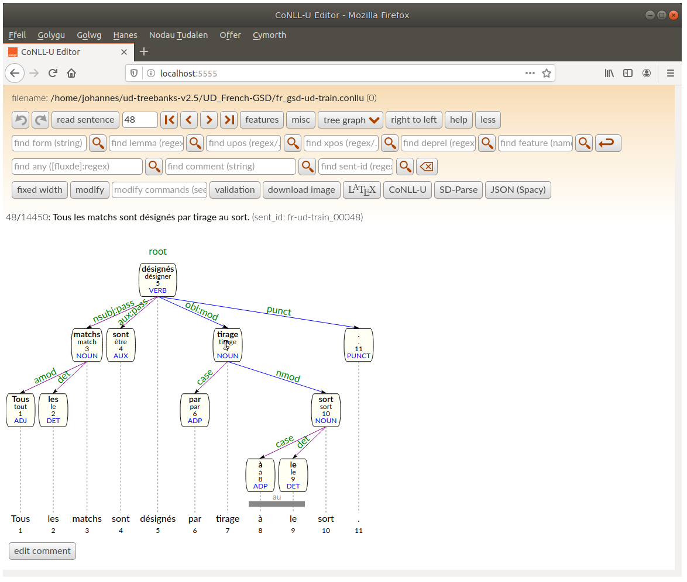

Clicking on `flat graph` changes the dependency graph layout to a more horizontal representation.


Word editing window (CTRL-click on the word). If UPOS/XPOS/deprels are given to the server,
autocompletion is proposed

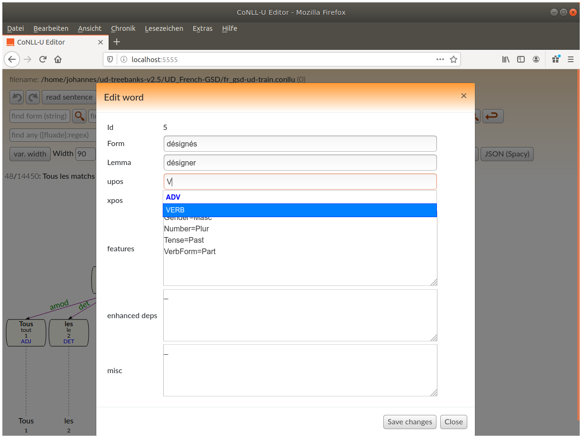

(Basic) Dependency relation window (click on deprel)

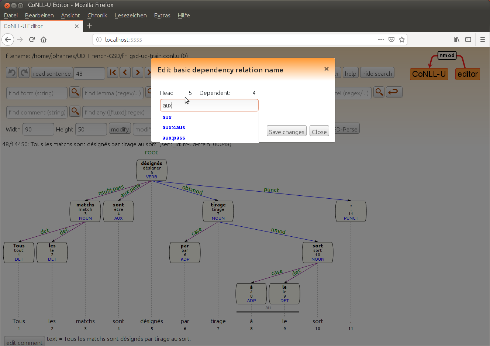

For languages which are written from the right to the left like Arabic or Hebrew, activate the `display right to left`-checkbutton

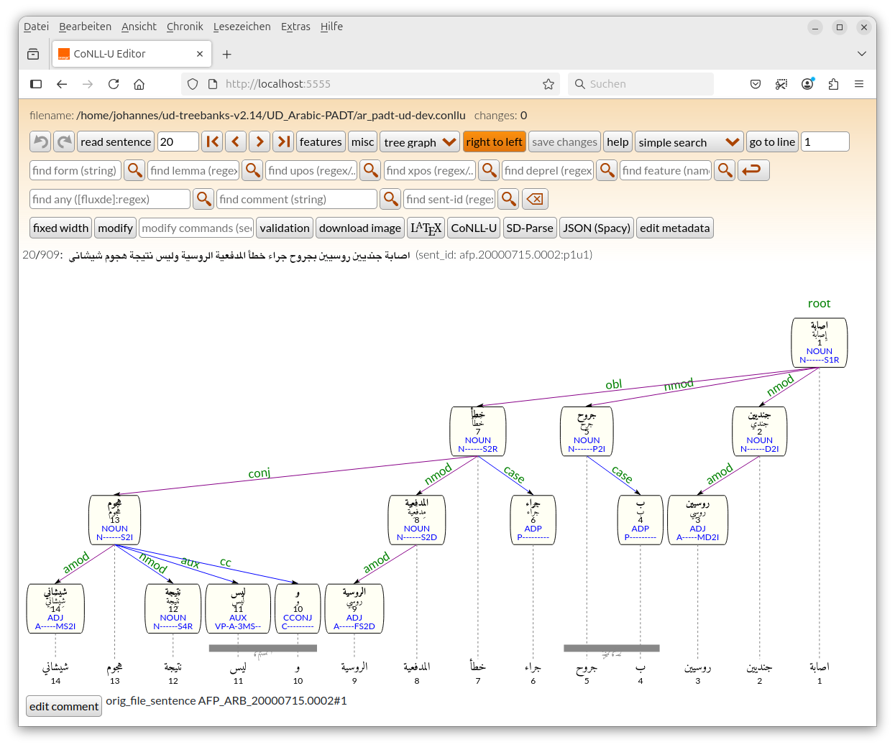

Empty nodes (having `n.1` ids) are shown in a dashed box.

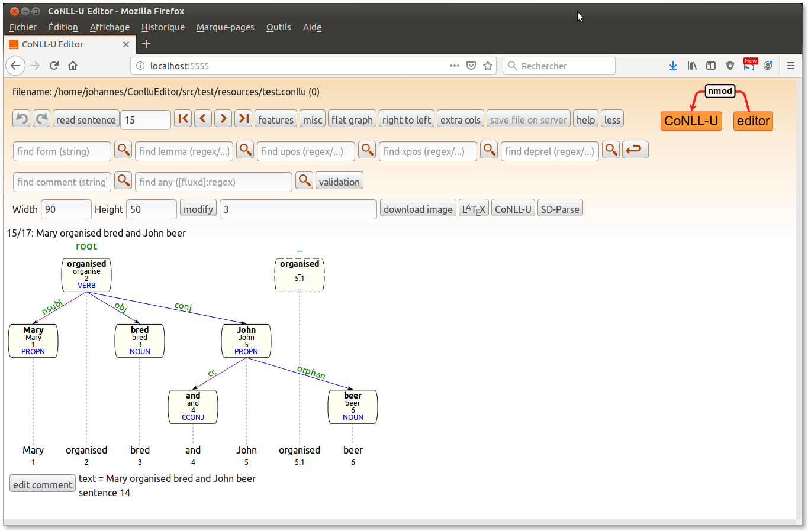

The flat graph mode also displays enhanced dependencies. In this mode enhanced
dependencies can be added/modified/deleted (activate `edit enhanced dependencies`).
if the button `show basic in enhanced` is active, all enhanced dependency relations which are also a basic dependency, are displayed too.

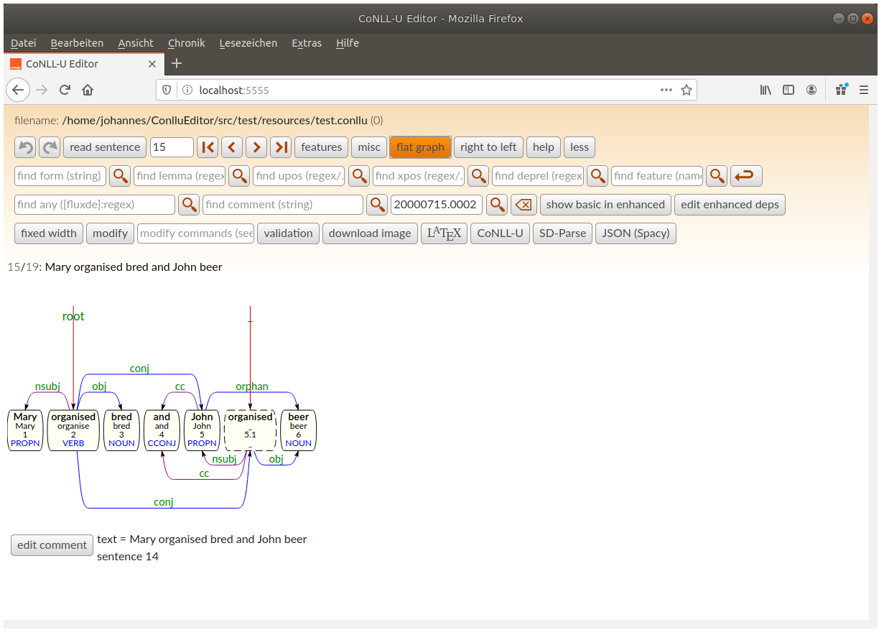

The buttons `CoNLL-U`, `LaTeX` and `SD-parse` open a window which contains the current sentence in the corresponding format.
LaTeX output includes MWE units as well as enhanced dependencies. The `download` downloads the current image as a svg-file.

In order to split a word or join two (adjacent) words, use the `modify` button: the command `split <wordid>` inserts a new
word to the right of <wordid>. This new word can then be edit, with a CTRL-click. The command `join <wordid>` merges the word with <wordid>
with the following. This joined word gets the dependency relation of the word closer to root.

Whole sentences can be split with the `sentsplit <wordid>` command. The current sentences can be concatenated with the following sentence
with `sentjoin` command.

In order to create a multiword token, use the `compose <wordid> <length>`
command. Click on the multiword token bar (at the bottom of the dependency
tree/graph to open a dialogue which allows to edit or delete the token (i.e. the `n-m` line).

## Enhanced Dependencies
Enhanced dependencies ([http://universaldependencies.org/format.html#syntactic-annotation])
in graphic mode can only be edited in flat mode. If the button `edit enhanced dependencies` is activated
clicking on words creates enhanced dependency relations. Click on the dependency label to modify it or to
delete the enhanced dependency relation.
Alternatively, enhanced dependenclies can be edited manually via the word edit menu.

## Other annotation
Even though, the CoNLL-U standard defines only 10 columns, columns beyond the 10th (MISC) column are conserved when editing such files.
They can be displayed in both modes (tree/flat) if the `extra cols` button is activated, but not (yet) be edited.
The values in these columns are not interpreted (for instance BIO markings), theyr are just shown.

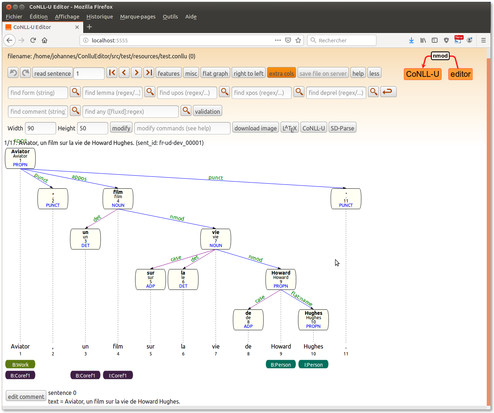


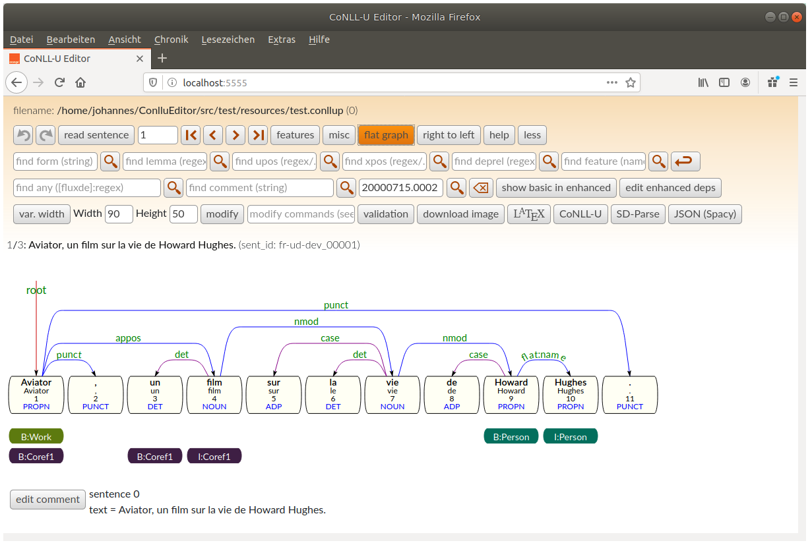

## Shortcuts
ConlluEdit uses a file [gui/shortcuts.json](gui/hortcuts.json) which defines shortcuts to accelarate editing: These single letter keys change the UPOS/XPOS/deplabel of
the active word to the defined value. To activate a word, click once on the word.
A personalised list (same format as [gui/shortcuts.json](gui/hortcuts.json)) can be used with the `--shortcuts` option. 

# Multiuser/save/git
The ConlluEditor can be used by multiple annotators at the time, provided that **no sentence is edited by more than one person at a time**.
To be on the safe side, start a server for every annotator on a different port/machine.
After each modification the edited file is saved:
* if the edited file is in a git versioned directory, each change is git-commited using the sentence number and the word id in the commit message.
* if not, it is saved under a different filename (adding `.2`) in the same directory, the original file is not modified.

# Validation
The ConlluEditor is able to load run a validation script on the current sentence. The programme and its arguments
must be configurated in a text file
```
script: /path/to/UniversalDependencies/tools/validate.py --lang cy --max-err 0 --level 5 {FILE}
```
`{FILE}` will be replaced with a file which contains the sentence to be validated in CoNLL-U format.
This configuration file must be given to the server with the option `--validator <filename>`.
The validation button will launch the validator on the current sentence.

# Server API (used by the GUI)
* `curl --noproxy '*' -F "sentid=1" -F "cmd=read 1"  http://host:port/edit/` get a sentence (first sentences is `read 0`, sendit is only used for edit commands)
* `curl -s --noproxy '*' 'http://host:port/edit/validlists'` get lists of valid upos/xpos/deprels, filename and version name
* `curl -s --noproxy '*' 'http://host:port/edit/getconllu?sentid=10'` get sentence 10 in CoNLL-U format
* `curl -s --noproxy '*' 'http://host:port/edit/getlatex?sentid=10'` get sentence 10 in LaTeX format (to use
  with the [tikz-dependency](https://ctan.org/pkg/tikz-dependency) or   [doc/deptree.sty](doc/deptree.sty) packages)

# Known bugs
* not all user errors are checked 😃: e.g. adding weird or non numerical ids in the CoNLL-U files may crash the server.
The feature, and misc column fields must contain one or more `|`-separated `name=value` pair per line (or `_`),
the enhanced dependency field must contain one or more `|`-separated `head:deprel` pair per line (or `_`).

# Todo list
* be able to read/write CoNLL-U plus (`.conllp`) files [http://universaldependencies.org/ext-format.html]
* edit columns from column 11 onwards
* better support for empty nodes
* rewrite ConllWord/ConllSentence classes from scratch
* use list (made from UD annotation guidelines) to warn about invalid relations (e.g. _case_ or _aux_ relations with further dependants)


# Parser Front-End
In order to display the CoNLL-U output of taggers/dependency parser servers, there the front-end provides a graphical user interface 
and sends the sentenced to be parsed to the back-end server such as [UDPipe](https://ufal.mff.cuni.cz/udpipe).
You can either use a local instance of the UDPipe-Server, or the instance provided by the authors of UDPipe (http://lindat.mff.cuni.cz/services/udpipe/).

First edit the configuration file [src/test/resources/udpipeserver.conf](src/test/resources/udpipeserver.conf):

```ini
# configuration to  make a request to a UDPipe server

# the url to send raw text to in order to get a CoNLL-U result (HTTP POST)
url: http://lindat.mff.cuni.cz/services/udpipe/api/process

# the URL providing some information on the parser (HTTP GET)
info: http://lindat.mff.cuni.cz/services/udpipe/api/models

# the name of the field to contain the text to be parsed
txt: data

# other fields which need to be present in the call to the parser
other: model=english-ud-1.2-160523,tokenizer=,tagger=,parser=

# if the parser response is in json, give the path to the CoNLL-U result
jsonpath: result
```

Second, run the Front-End server:

```
./bin/parserclient.sh -r src/test/resources/udpipeserver.conf 3434
```

Open your browser on the given port: `http://localhost:3434`

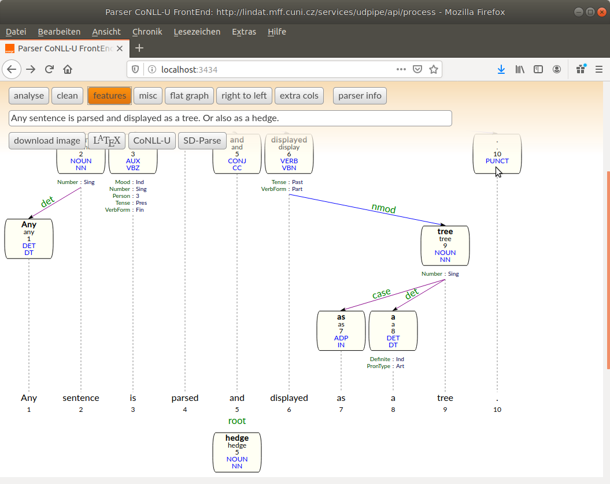

The dependency tree can also be displays as a hedge

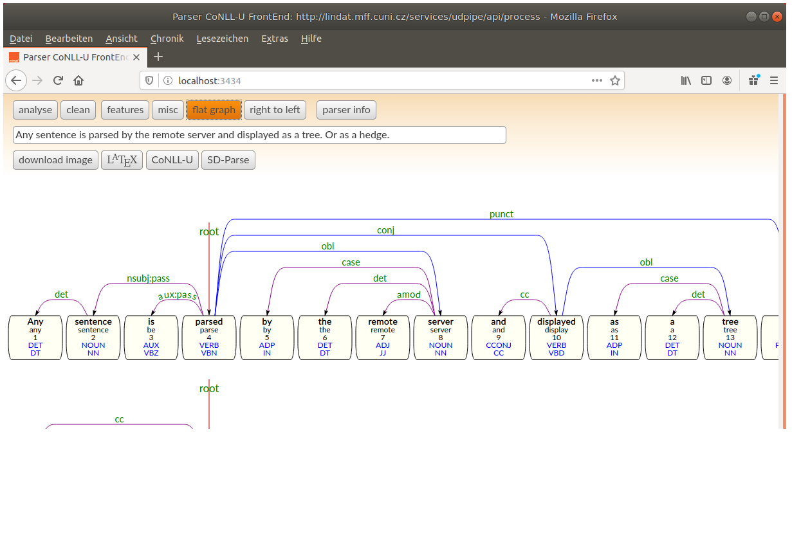

The `parser info` buttons provides information given by the parser server

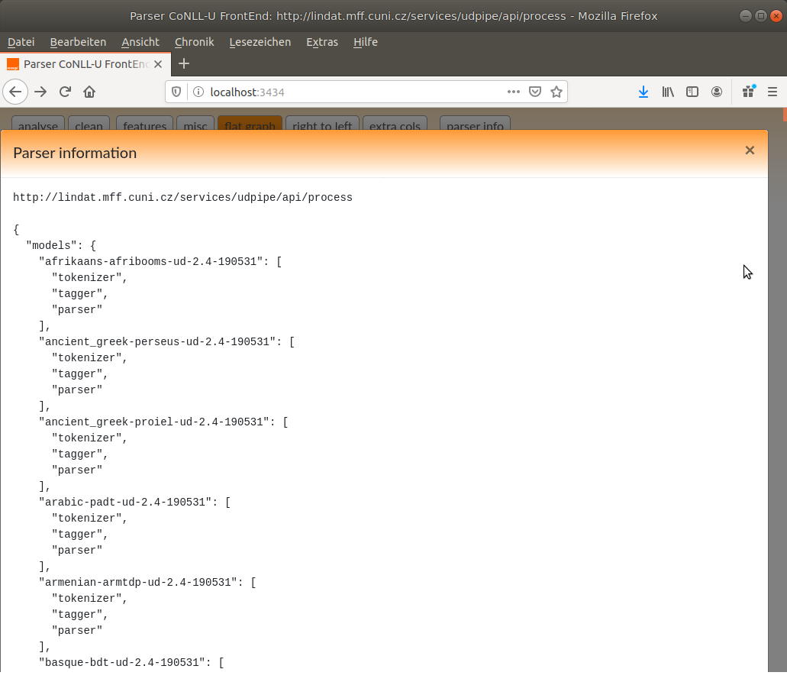

If the tokenizer segments the input in several sentences, all we be displayed.

The buttons `CoNLL-U`, `LaTeX` and `SD-parse` open a window which contains the current sentence in the corresponding format.
LaTeX output includes MWE units as well as enhanced dependencies. The `download` downloads the current image as a svg-file.


# File Comparison

ConlluEditor permits you to visualise the differences of two CoNLL-U files, as for instance a gold file and 
the output of a parsing tool. In order use the comparison mode start ConlluEditor with
an option to indicate the gold file

```
./bin/conlluedit.sh --rootdir  /path/to/ConlluEditor/gui --compare gold.conllu predicted.conllu 8888
```

The dependency tree of the gold file is shown in gray underneath the tree ofthe file being edited.
The results of some evaluation metrics for the current sentence are presented at the bottom of the header.
Individual words of the edited file, which differ from the gold file are shown with a red border. If the mouse
hovers over such a word, the corresponding lines from the edited file and the gold file are shown 
under the evaluation scores.
The comparison mode worsk in the flat view too.

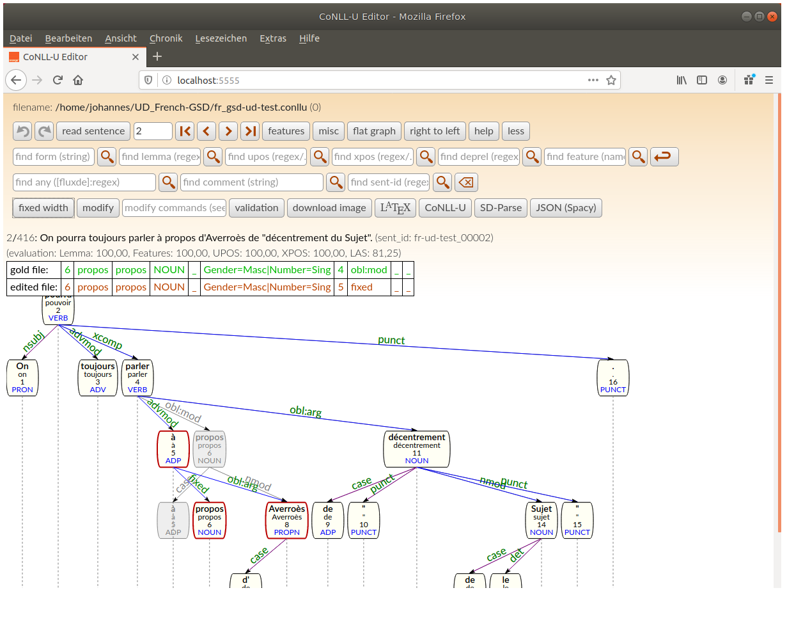


# Reference

* Johannes Heinecke (2019): [ConlluEditor: a fully graphical editor for Universal dependencies treebank files](https://syntaxfest.github.io/syntaxfest19/proceedings/papers/paper_55.pdf). In: [Universal Dependencies Workshop 2019](http://universaldependencies.org/udw19/). Paris. ([Short demo video](https://syntaxfest.github.io/syntaxfest19/slides/conllueditor_demo_windows_subtitled.mp4))


