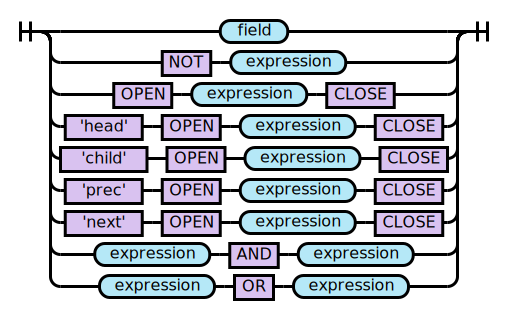
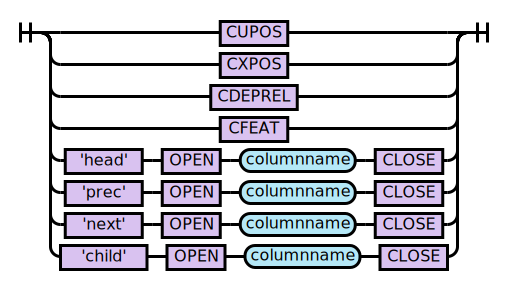
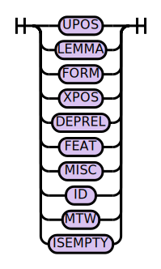
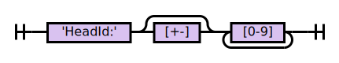
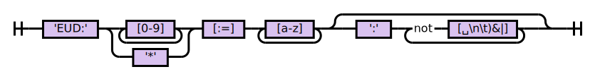
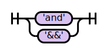
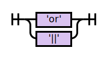
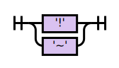

# Formal Grammar for Conditions

ANTLR4 Grammar: [Conditions.g4](../../src/main/antlr4/com/orange/labs/conllparser/Conditions.g4) 
## prog

## expression

## columnname

## field

## UPOS

## LEMMA

## FORM

## XPOS

## DEPREL

## FEAT

## MISC

## ID

## MWT

## HEADID

## RELEUD

## ABSEUD

## ISEMPTY

## ISMWT

## AND

## OR

## NOT

## OPEN

## CLOSE

## AT

## EQUALS

## COMPATIBLE

## CUPOS

## CXPOS

## CDEPREL

## CFEAT

## WS

