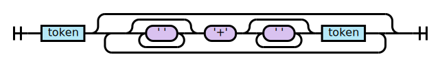
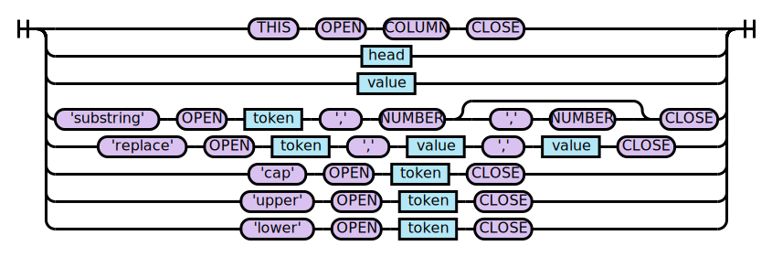
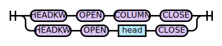
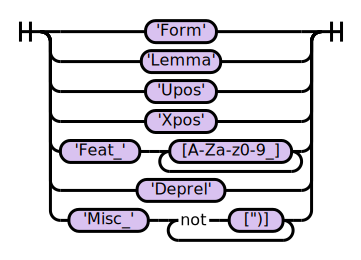

# Formal Grammar for Replacements

ANTLR4 Grammar: [Replacements.g4](../../src/main/antlr4/com/orange/labs/conllparser/Replacements.g4) 
## prog

## expression

## token

## head

## value

## QUOTE

## OPEN

## CLOSE

## THIS

## HEADKW

## COLUMN

## NUMBER

## CHARS

## WS

